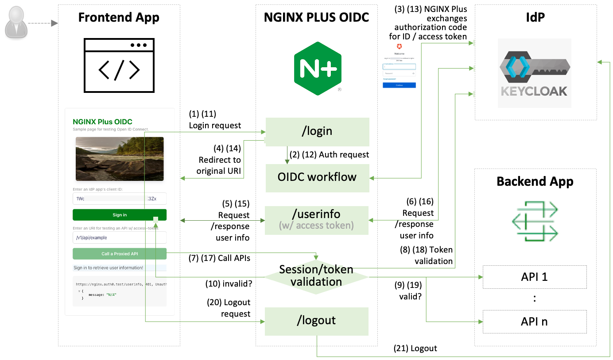

# [WIP] nginx-oauth2

Reference Implementation for Validating OAuth 2.0 Access Tokens with NGINX, NGINX Plus and Keycloak.

> **Note:**
> We are going to add OAuth2.0 access token introspection module and examples here on top of OIDC framework for maintainability and reusability as OIDC is added authentication on top of OAuth2.0.

This repo provides the information of how to set up Keycloak, integrate with NGINX and NGINX Plus, and locally test using a containerized NGINX Plus app, a frontend simulation tool, and a NGINX API Connectivity Management.

- [Getting Started](#🏠-getting-started)
- [Troubleshooting](#🔧-troubleshooting)
- [References](#📚-references)

 

## 🏠 Getting Started

### Set up an identity provider (IdP)

- [Create and configure an app in Keycloak](./docs/01-IdP-Setup.md)

### Option 1. Set up and Test a Access Token Validation via NGINX Plus

- [Configure NGINX Plus OIDC](./docs/02-NGINX-Plus-Setup.md)
- [Locally Test an SSO app in a container ](./docs/03-Container-Test.md)

### Option 2. Set up and Test a Access Token Validation via NGINX ACM

- [Install, configure, and test OIDC via NGINX ACM](./docs/04-NGINX-DevPortal-Test.md)

 

## 🔧 Troubleshooting

- [Common Troubleshooting for NGINX OAuth2](https://github.com/nginx-openid-connect/nginx-oidc-troubleshooting#-common-troubleshooting-for-nginx-oidc-and-all-idps)
- [Troubleshooting for NGINX OAuth2 and Keycloak](https://github.com/nginx-openid-connect/nginx-oidc-troubleshooting#troubleshooting-for-nginx-plus-oidc-and-keycloak)

 

## 📚 References

- [NGINX OIDC Core v1.0: Forked from NGINX GitHub](https://github.com/nginx-openid-connect/nginx-oidc-core-v1)
- [NGINX OIDC Core v2.0: Forked from NGINX GitHub](https://github.com/nginx-openid-connect/nginx-oidc-core)
- [NGINX Plus: Single Sign-On With Keycloak](https://docs.nginx.com/nginx/deployment-guides/single-sign-on/keycloak/)
- [NGINX Management Suite](https://docs.nginx.com/nginx-management-suite/)
- [NGINX API Connectivity Manager](https://docs.nginx.com/nginx-management-suite/acm/)
- [https://www.nginx.com/blog/validating-oauth-2-0-access-tokens-nginx/](https://www.nginx.com/blog/validating-oauth-2-0-access-tokens-nginx/)
