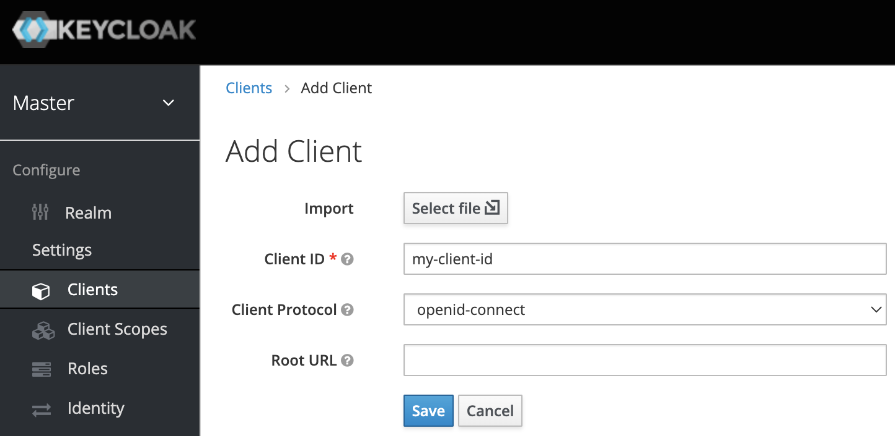
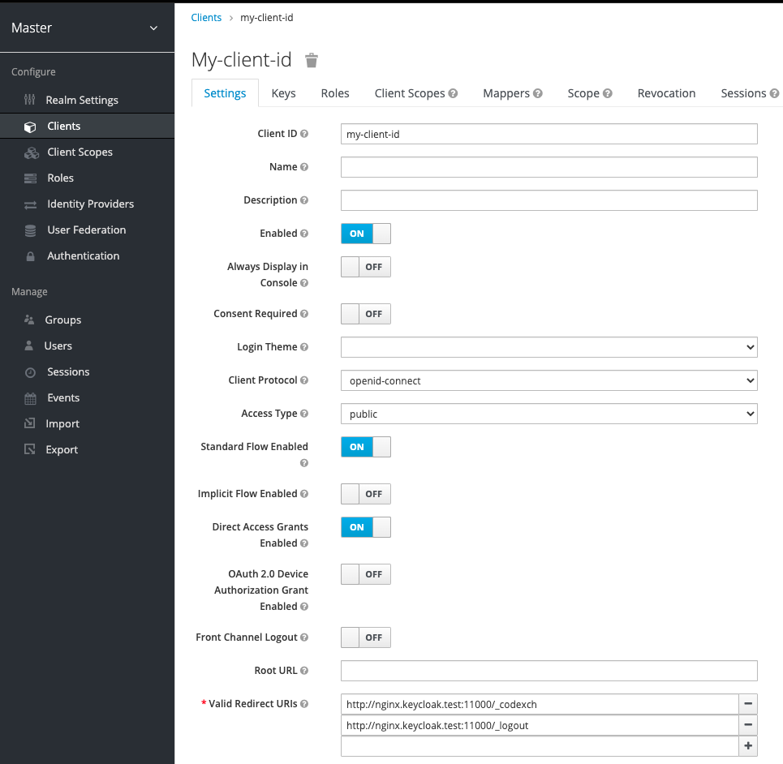

# How To Configure Keycloak for NGINX Plus OIDC Integration

Take the following steps to create a new application of Keycloak for integrating with NGINX Plus.

> **Note:**
>
> The following procedure reflects the Keycloak GUI at the time of publication, but the GUI is subject to change. Use this guide as a reference and adapt to the current Keycloak GUI as necessary.

- [Create a Client](#create-a-client-app)
- [Create a Role](#create-a-role)
- [Create a User](#create-a-user)

## Create a Client App

Create a Keycloak client for NGINX Plus in the Keycloak GUI:

1.  Access the Keycloak Admin Console at **`http://keycloak-server-address:8080/auth/admin/`** and log in.

    > Note:
    >
    > In the example of this repository, use the following information after running a docker containter for the purpose of testing.
    >
    > - **URL**: `http://localhost:8080/auth/admin`
    > - **Basic Auth**: `admin / password` ([Where to change](https://github.com/nginx-openid-connect/nginx-oidc-keycloak/blob/main/docker-compose.yml#L37))

     

    

2.  In the left navigation column, click **Clients**. On the **Clients** page that opens, click the **Create** button in the upper right corner.

3.  On the **Add Client** page that opens, enter or select these values, then click the **`Save`** button.

    - **Client ID** – The name of the application for which you’re enabling SSO (Keycloak refers to it as the “client”). Here we’re using `my-client-id`.
    - **Client Protocol** – openid-connect.

    

4.  On the **my-client-id** page that opens, enter or select these values on the **Settings** tab:

    - **Access Type**:

      - Option 1. Check `confidential` if you **don't enable PKCE**.
      - Option 2. Check `public` if you **enable PKCE**.

    - **Valid Redirect URIs** – The URI of the NGINX Plus instance, including the port number, and ending in the following URIs:

      - **`/_codexch`**: in this guide it is `http://nginx.keycloak.test:11000/_codexch`
      - **`/_logout`**: in this guide it is `http://nginx.keycloak.test:11000/_logout`

      > **Notes:**
      >
      > - For production, we strongly recommend that you use SSL/TLS (port 443).
      > - The port number is mandatory even when you’re using the default port for HTTP (80) or HTTPS (443). But it it isn't needed if you use NGINX ACM.

       

      

5.  Click the `Credentials` tab and make a note of the value in the **Secret** field. You will copy it into the [NGINX Plus configuration file](https://github.com/nginx-openid-connect/nginx-oidc-keycloak/blob/main/oidc_idp.conf) in **Step 3** of [Configuring NGINX Plus](https://github.com/nginx-openid-connect/nginx-oidc-keycloak/blob/main/docs/02-NGINX-Plus-Setup.md#configure-nginx-openid-connect).

    > **Notes**: This is only used for the step if you choose `Access Type: confidential` when you don't enable PKCE.

     

    

## Create a Role

1.  Click the `Roles` tab, then click the **Add Role** button in the upper right corner of the page that opens.

    

2.  On the **Add Role** page that opens, type a value in the **Role Name** field (here it is `nginx-keycloak-role`) and click the  Save  button.

    

## Create a User

1. In the left navigation column, click **Users**. On the Users page that opens, either click the name of an existing user, or click the **Add user** button in the upper right corner to create a new user. For complete instructions, see the [Keycloak documentation](https://www.keycloak.org/docs/latest/server_admin/index.html#user-management).

   

2. **Optional**. **Reset password** if you want to set a password for your testing:

   

3. On the management page for the user (here, **user-01**), click the `Role Mappings` tab. On the page that opens, select **my-client-01** on the **Client Roles** drop‑down menu. Click `nginx-keycloak-role` in the **Available Roles** box, then click the **Add selected** button below the box. The role then appears in the **Assigned Roles** and **Effective Roles** boxes, as shown in the screenshot.
   
